<h1 align="center">基于深度异构特征融合的多模态行人重识别 
      Multimodal Person Re-Identification Based on Deep Heterogeneous</h1>
<p align="center">

<p align="center">

  <p align="center">
    <a href="https://github.com/xiaozhou-alt" rel="external nofollow noopener" target="_blank"><strong>Haojing Zhou</strong></a>
  </p>
<p align="center">


## 📌 项目简介

行人重识别是智能安防与智慧城市建设的核心技术，旨在实现非重叠摄像头下的行人身份精准匹配。传统单模态方法易受光照变化、恶劣天气等环境干扰，难以满足全天候检索需求；现有多模态方法仍面临模态分布异构、跨模态对齐困难、互补信息挖掘浅层化等挑战。

本工作基于预训练Vision Transformer提出**异构模态适配与原型进化重识别框架（Heterogeneous Adaptation Prototype Evolution Re-Identification，HAPE-ReID）**：

1. 通过**异构模态适配器\(HMA\)**完成多模态特征的逐层校准与针对性增强，有效消解模态间分布异构性

2. 通过**跨模态原型进化器\(CPE\)**深度挖掘模态间细粒度互补信息，结合GRU门控实现身份原型的稳定迭代进化

3. 最终生成兼具强判别性与高鲁棒性的统一身份表征，显著提升复杂场景下多模态行人重识别的精度与泛化能力

## ✨ 核心创新点

1. **参数高效的三分支多流架构**：基于冻结的预训练ViT\-B/16搭建三分支特征提取结构，仅训练轻量级适配与进化模块，大幅降低训练成本，同时完整保留预训练通用视觉知识与三模态专属互补信息

2. **异构模态适配器\(HMA\)**：嵌入Transformer编码器层，针对RGB、NIR、TIR的成像特性设计差异化门控激活策略，实现全局语义与局部细粒度特征的分层适配，逐层消解模态分布偏差

3. **跨模态原型进化器\(CPE\)**：以交叉注意力机制动态提取跨模态互补摘要，结合简化GRU门控实现身份原型的层间稳定迭代，有效缓解原型漂移，构建高一致性的统一身份表征

4. **模块协同增益**：HMA的前端模态校准与CPE的后端原型进化形成超加性协同效应，大幅提升模型跨模态检索精度与鲁棒性


## 🔧 方法框架

### 整体架构

HAPE\-ReID整体由三部分组成：多流特征提取分支、异构模态适配器\(HMA\)、跨模态原型进化器\(CPE\)。

<p align="center">
    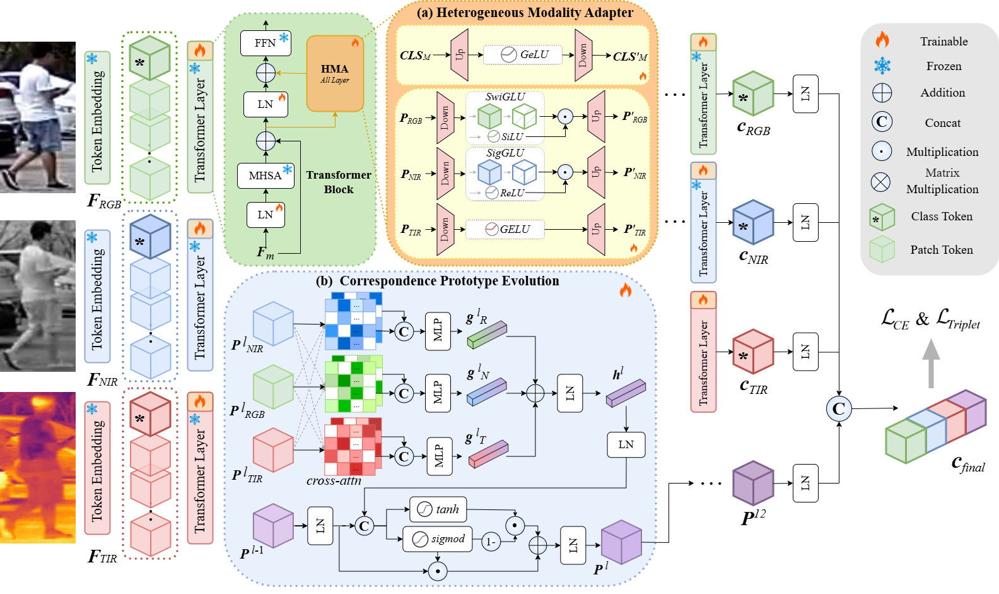
</p>

### 1\. 异构模态适配器 \(Heterogeneous Modality Adapter, HMA\)

- 嵌入Transformer编码器MHSA与FFN之间，以残差方式无侵入式注入模态专属增强信号

- 全局CLS分支跨模态共享参数，完成全局语义的统一校准

- 局部分支针对三类模态设计差异化激活策略：


```tex
- RGB模态：SwiGLU门控结构，强化颜色纹理特征并抑制背景杂波
- NIR模态：ReLU+Sigmoid组合门控，增强轮廓特征同时抑制光照噪声
- TIR模态：GELU瓶颈结构，强化热辐射差异与整体轮廓信息
```

### 2\. 跨模态原型进化器 \(Cross-modal Prototype Evolution, CPE\)

- 从Transformer第6层启动跨层迭代，兼顾特征语义成熟度与迭代空间，平衡特征质量与精炼空间

- **跨模态互补聚合**：以当前模态全局平均特征为Query，通过单头交叉注意力从其他模态动态提取互补信息，过滤无效噪声，生成纯净的跨模态全局特征摘要

- **门控原型更新**：通过简化GRU门控软性控制历史原型与当前摘要的融合比例，保证身份语义在层间稳定累积，从根源避免身份原型漂移

- **全局特征融合**：融合三模态全局特征与迭代优化后的身份原型，输出高判别性、高鲁棒性的统一检索表征

<p align="center">
    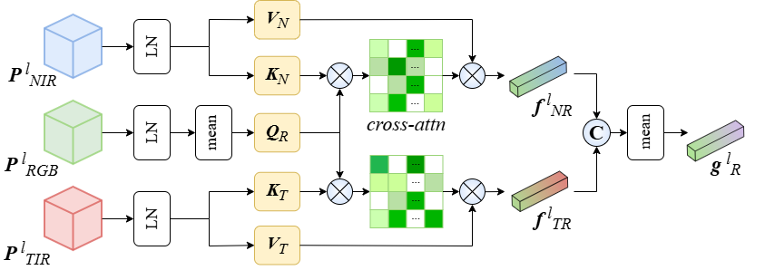
</p>


## 📊 实验结果

### 1\. 与流行方法对比

<p align="center">
    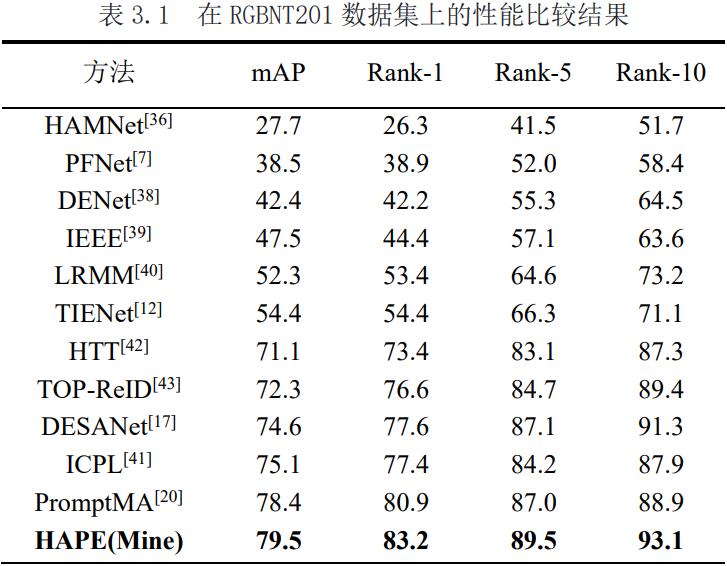
</p>

<p align="center">
    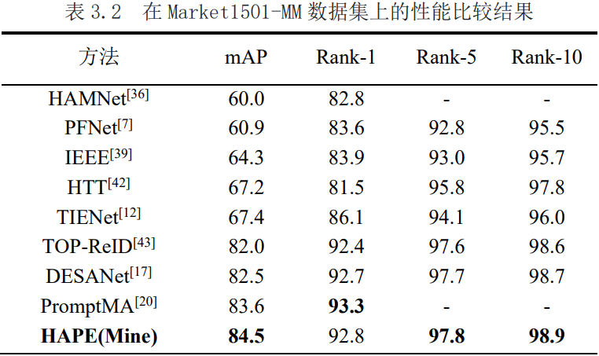
</p>

### 2\. 核心消融实验结论

<p align="center">
    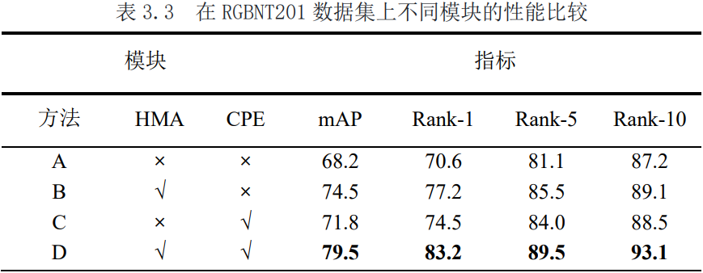
</p>
<p align="center">
    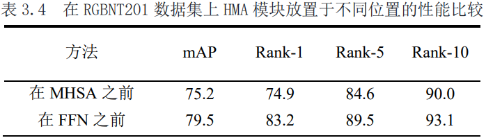
</p>

<p align="center">
    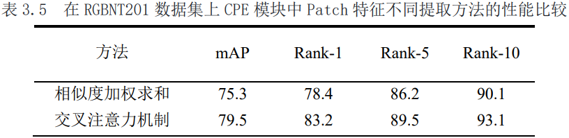
</p>

<p align="center">
    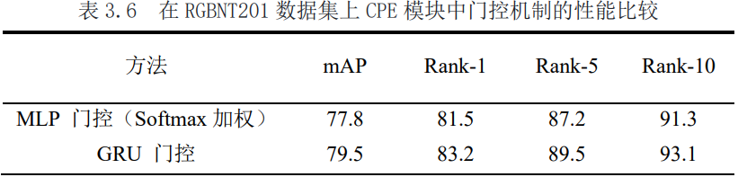
</p>


<p align="center">
    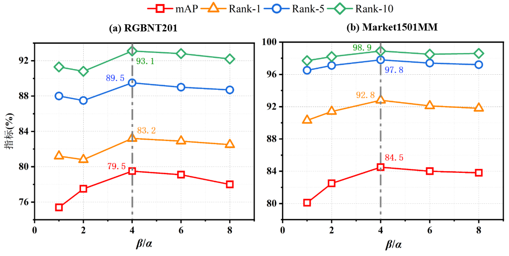
</p>

<p align="center">
    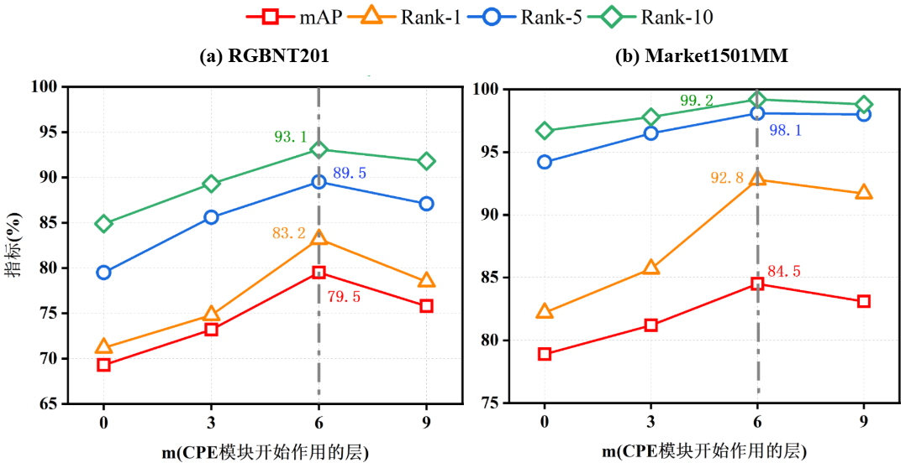
</p>
### 3\. 可视化验证

### t-SNE

<p align="center">
    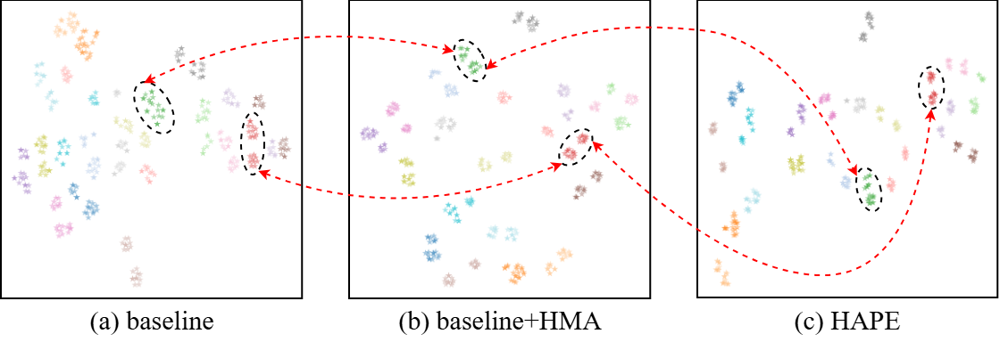
</p>
### 热力图


<p align="center">
    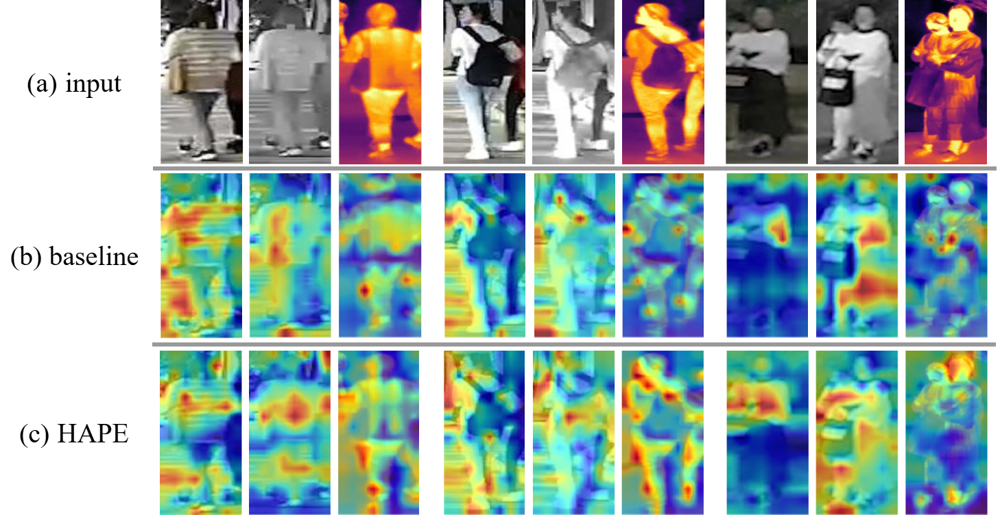
</p>
### 前10检索结果


<p align="center">
    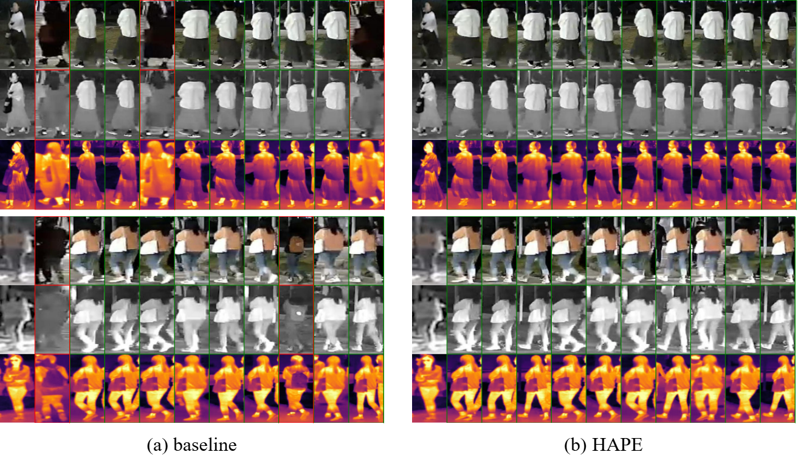
</p>


# 🚀 复现指南

### 数据集

- **RGBNT201**: [Google Drive](https://drive.google.com/drive/folders/1EscBadX-wMAT56_It5lXY-S3-b5nK1wH)  
- **Market1501MM**：[Google Drive](https://drive.google.com/drive/folders/1EscBadX-wMAT56_It5lXY-S3-b5nK1wH) 

### 预训练模型

- **CLIP**: [Baidu Pan](https://pan.baidu.com/s/1YPhaL0YgpI-TQ_pSzXHRKw) (Code: `52fu`)

### 配置文件

- RGBNT201: `configs/RGBNT201/HAPE.yml`  
- Market1501MM: `configs/Market1501MM/HAPE.yml`  

## 训练

```bash
conda create -n HAPE python=3.9.11 -y 
conda activate HAPE
pip install torch==2.0.0 torchvision==0.15.0 torchaudio==0.15.0 --index-url https://download.pytorch.org/whl/cu117
cd (your_path)
pip install -r requirements.txt
python train_net.py --config_file configs/RGBNT201/HAPE.yml
```


## 📝 引用

如果本工作对您的研究有帮助，欢迎引用本毕业论文：

```bibtex
@thesis{zhou2026hape,
  title={基于深度异构特征融合的多模态行人重识别},
  author={周皓靖},
  school={大连理工大学},
  year={2026}
}
```
